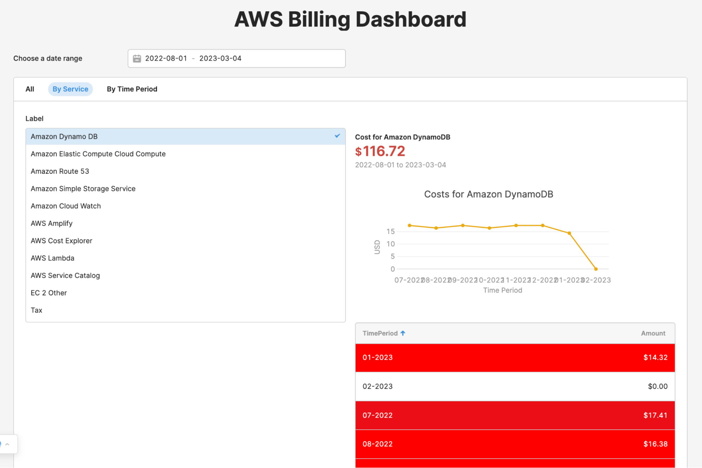
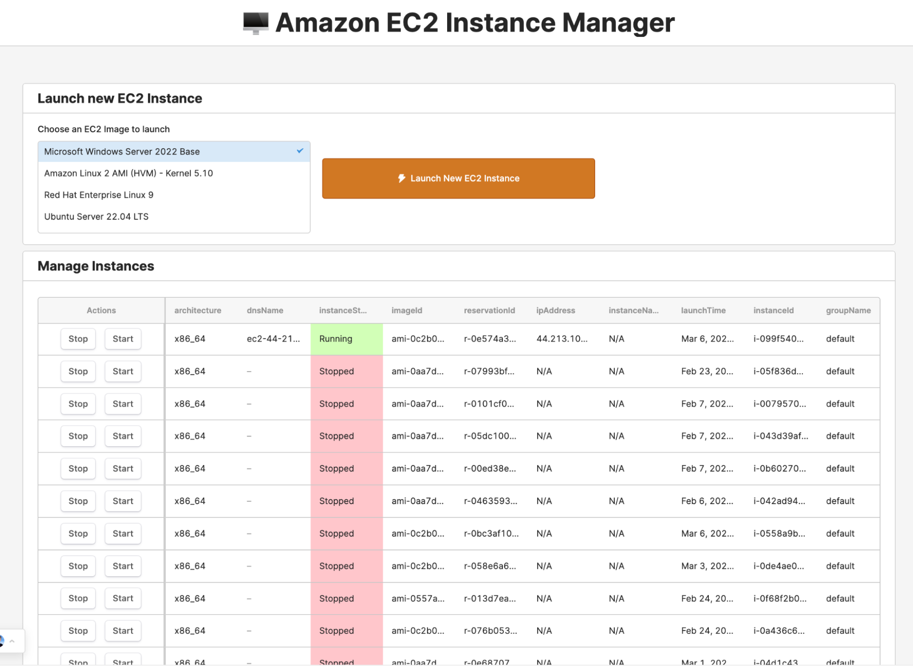

# Welcome to the Retool DevOps workshop!
This workshop will guide you through building two Retool apps that integrate with AWS services. It will show you how Retool can help you create powerful, user-friendly interfaces for managing your AWS resources.

## What is Retool

[Retool](https://retool.com/) is a development platform that lets you build and deploy internal applications quickly with a drag-and-drop interface. It includes all the dev tools and runtime components you need to create an application, including a visual IDE and [UI component library](https://retool.com/components) to build front ends, as well as backend services to handle, with [native connectors for most databases and APIs](https://retool.com/integrations/). 

So instead of building a custom application from scratch using a mix of different tools, frameworks, and infrastructure, Retool provides a complete development stack where all the pieces are designed to work together.

## What you will build

### Module 1: Custom AWS Billing Dashboard

In the first module, you will build an AWS Billing Dashboard using Retool and [AWS Cost Explorer API](https://docs.aws.amazon.com/cost-management/latest/userguide/ce-api.html). This dashboard will provide you with a quick overview of costs incurred for a given time range, grouped by service and time period. You will learn how to use Retool to connect to AWS Cost Explorer API, retrieve data, and create tab views, charts, and tables to visualize and display your AWS billing data.

#### Why build a custom AWS Billing Dashboard

- **Simple cost overview:** Provides an easy-to-understand overview of costs incurred for a given time range, grouped by service and time period, allowing business leaders and non-technical users to quickly view costs without having to navigate the complex AWS console
- **Intuitive data visualization:** Offers an intuitive and user-friendly interface for visualizing and understanding AWS costs and usage patterns, making it easier for non-technical users to identify areas where costs can be optimized.

### Module 2: Custom Amazon EC2 Instance Admin Panel

In the second module, you will build an Amazon EC2 Instance Manager using Retool and [Amazon EC2 API](https://docs.aws.amazon.com/AWSEC2/latest/APIReference/making-api-requests.html). This app will allow you to launch new EC2 instances from a list of available Amazon images and view and manage a list of EC2 instances with start and stop buttons for each instance. You will learn how to use Retool to connect to Amazon EC2 API, retrieve data, and create forms, tables, and buttons to manage your EC2 instances.

#### Why build a custom Amazon EC2 Instance Manager

- **Simplified image selection:** Allows users to select a limited list of Amazon images to choose from, providing more control over the virtual servers to launch and avoiding confusion in a team environment
- **Quick instance launching:** Users can quickly launch new instances with just a few clicks, as opposed to manually creating a new instance in the AWS console
- **Easy instance management:** Users can easily view and manage a list of EC2 instances with start and stop buttons for each instance, providing a more efficient and user-friendly experience compared to using the AWS console

Throughout the workshop, you will learn how to use Retool's intuitive drag-and-drop interface to create custom applications that are tailored to your specific needs. By the end of this workshop, you will have two powerful Retool apps that will help you better manage your AWS resources and optimize costs.

## Prerequisite

To be able to build these modules, you would need **AWS client ID and secret** of an AWS user that has permissions to access Amazon EC2 AP, and AWS Cost Explorer API.

This guide **includes a burner client id and secret** you can use for the purposes of this workshop. Please note that **these will be destroyed after the workshop** and you would not be able to use them. 

Alternatively, if you would like to use your own AWS account so you can explore your own data through these apps, please see the section at the end of this guide for step-by-step instructions on [Creating and attaching EC2 and Cost Explorer Permissions to an IAM user](/aws-creds.md).

Let’s get started!

[Module 1](/module-1.md)

[Module 2](/module-2.md)

# Wrapping Up

Congratulations! You've successfully completed this self-guided workshop and built two Retool apps that connect to AWS APIs. You learnt how to use Retool to retrieve and display data, create tabbed containers, use list boxes as inputs for queries, and visualize data with charts.

Remember, these two apps are just the tip of the iceberg when it comes to what you can build with Retool and AWS. The possibilities are endless, and we encourage you to continue exploring and building on what you've learned here.

If you have any questions or feedback, please don't hesitate to reach out to us. We'd love to hear your thoughts and help in any way we can.

Thanks again for your time and effort in completing this workshop. We hope you found it valuable and look forward to seeing what you'll create next with Retool.

# Resources

[JSON for Retool AWS Cost Explorer App](https://gist.githubusercontent.com/ajot/6ecab2518cb56e05a21ba8b1ea2c1102/raw/8f614f16819ddbf12017a67a9efa3ff64177be99/retool_aws_cost_explorer_app.json)

[JSON for Retool Amazon EC2 Instance Admin Panel app](https://gist.githubusercontent.com/ajot/e84dff09500d47ba09cd7f5c33e63e6e/raw/3c809237b6fefa2314ab738e6baa62f292cc6eb8/retool_amazon_ec2_instance_admin_panel.json)

[Retool Templates](https://retool.com/templates/)