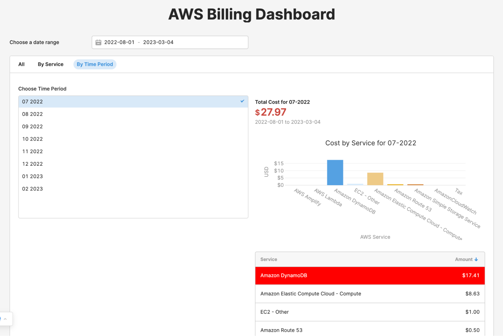
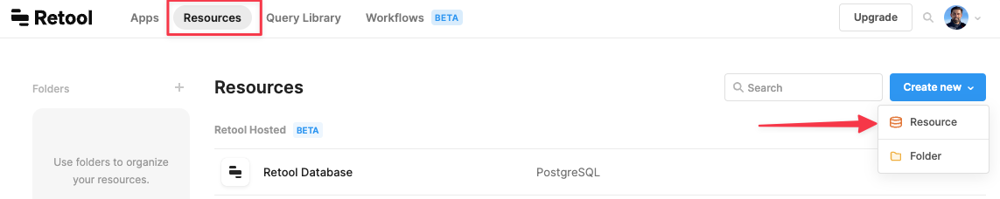
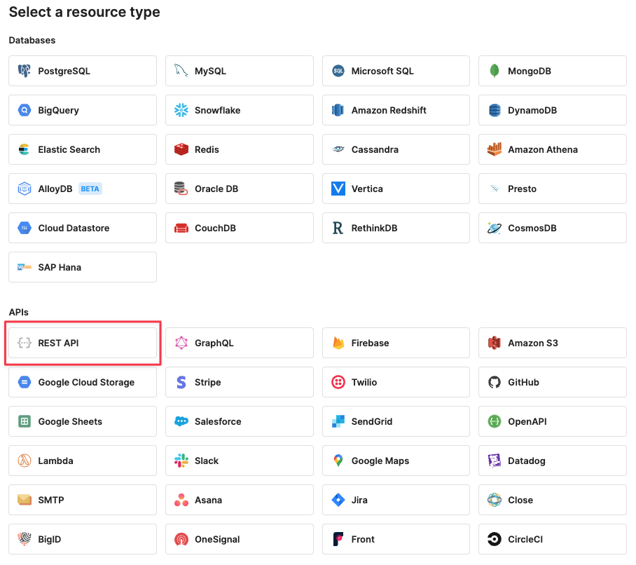
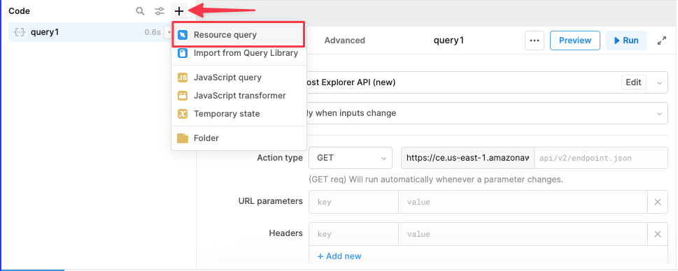
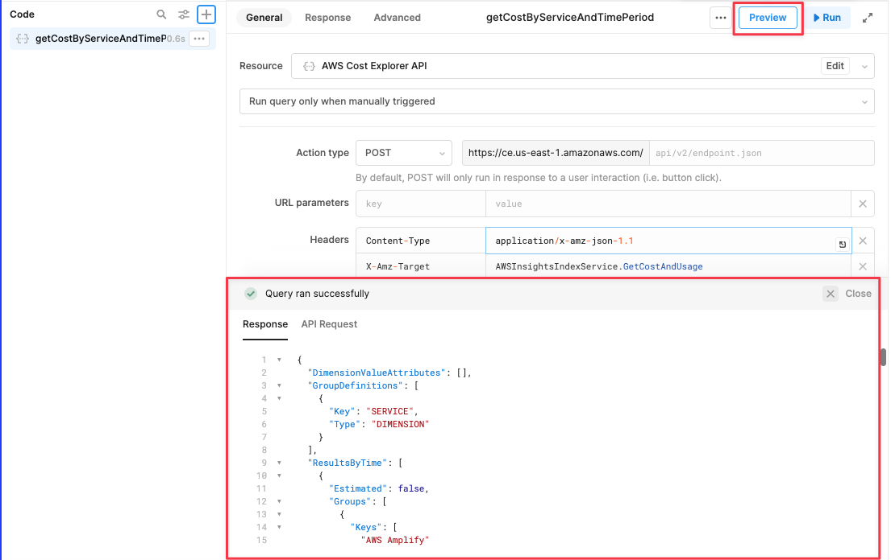
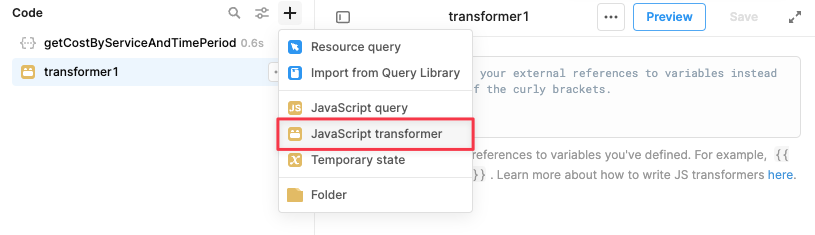
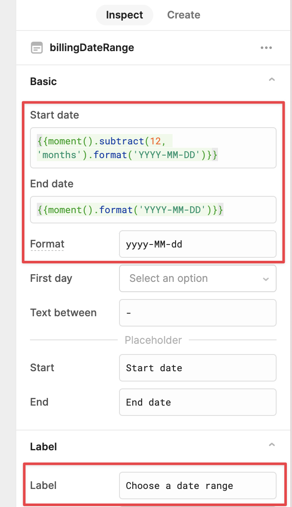
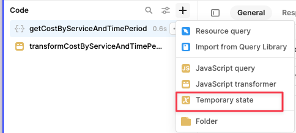

# Module 1: Creating an AWS Billing Dashboard


## Overview

In this module, you will learn how to use Retool and [AWS Cost Explorer API](https://docs.aws.amazon.com/cost-management/latest/userguide/ce-api.html) to build an AWS Billing Dashboard. The dashboard will provide a quick overview of costs incurred for a given time range, grouped by Service and Time Period. You will create three tab views: "All," "By Service," and "By Time Period." Here are some screenshots of what we will be building - 


_The main screen shows the costs for all services during the chosen date range. Anything more than $20 is highlighted in red._



_View costs by Service_


_View costs by Time Period_


## What you will learn

1. How to use Retool to connect to [AWS Cost Explorer API](https://docs.aws.amazon.com/cost-management/latest/userguide/ce-api.html)
2. How to retrieve and display data retrieved from AWS Cost Explorer API using [Retool’s component library](https://retool.com/components)
3. How to create tab views using Retool’s <code>[Tabbed Container](https://retool.com/components/tabbed-container)</code> component
4. How to use [Listbox](https://retool.com/components/listbox) component as an input for a query.
5. How to use Chart component to visualize the AWS billing data
6. How to use a [Table](https://retool.com/components/table) component to display data
7. How to use a [Date Range](https://retool.com/components/date-range) component to allow users to select a time range

### Option to Import JSON File to Create App
> We highly recommend following each step to get the most out of the guide. 
> 
> However, if you prefer, you can skip Part 2 of this module and [import](https://docs.retool.com/docs/import-export-apps?ref=retool-blog) this JSON file to create the app. 
> 
> Keep in mind that **you will still need to go through Part 1 of this module**, and create a Resource since it connects to the AWS API with your AWS credentials.
> 
> - [JSON for this app](/cost_explorer_app.json)
> - [Instructions to create a new app using a JSON file](https://docs.retool.com/docs/import-export-apps?ref=retool-blog)

## Part 1: Create a Resource in Retool for AWS Cost Explorer API (20 Mins)


1. Get your AWS Credentials following the instructions here. See section “Setting up the AWS Credentials”
2. Signup for a free Retool account
3. Create a new Resource for AWS Cost Explorer API in Retool using your AWS credentials
    1. Login to Retool, and then click on the Resources tab in the top menu bar. 
    2. Click Create new, and then choose Resource





4. On the “Select a resource type” page, choose REST API




5. Configure the REST API using the configuration below -

| Property              | Value                                           |
|-----------------------|-------------------------------------------------|
| Name                  | `AWS Cost Explorer API`                         |
| Base URL              | `https://ce.us-east-1.amazonaws.com`            |
| Authentication        | `AWS v4`                                        |
| AWS Region            | `us-east-1`                                     |
| AWS Access Key ID     | `<YOUR AWS Access Key ID>`                      |
| AWS Secret Access Key | `<YOUR AWS Secret Access Key>`                  |

6. Click **Create resource**


7. The Resource will be created, and you will be prompted to “Create an app”
8. Click <strong>Create an app</strong>, and give it a name - example <code>AWS Cost Explorer App</code>


We are done creating the Resource. Let's now connect to it by creating an app.

## Part 2: Create the Retool app using this Resource (45 mins)


### 1-Get data from AWS Cost Explorer API by creating a Resource query

[Queries](https://docs.retool.com/docs/queries) are the way we pull in data (read or write data) into a Retool app, so we can use them in components. In this case, we'll create a query that gets the costs from the AWS Cost Explorer API, grouped by month and service.

Here’s what the [App editor](https://docs.retool.com/docs/app-editor) for a new Retool app looks like. 


1. With your new Retool app open, on the bottom panel, click the **+** button to create a new Resource Query, 
2. Rename it to `getCostByServiceAndTimePeriod` (right click the query name in the left side bar)




2. Configure the Resource query as below -

| Property | Value |
|----------|-------|
| Resource | `AWS Cost Explorer API` (this is the resource you created earlier)|
| Action type | `POST` |
| Headers | `Content-Type` : `application/x-amz-json-1.1`<br>`X-Amz-Target` :  `AWSInsightsIndexService.GetCostAndUsage` |
| Body | `Raw` : See JSON below|

3. Paste this JSON in the `Body`

```json
{
  "TimePeriod": {
    "Start": "2022-08-01",
    "End": "2023-03-04"
  },
  "Granularity": "MONTHLY",
  "Metrics": ["BlendedCost"],
  "GroupBy": [
    {
      "Type": "DIMENSION",
      "Key": "SERVICE"
    }
  ]
}
```


3. Set this query to run on page load 
    1. With `getCostByServiceAndTimePeriod` query selected, click on `Advanced` tab
    2. Check the box for `Run this query on page load?`
    3. **Save**


4. Click **Preview** to get the confirmation that the “Query ran successfully”, and see the response and the API request in the Results panel at the bottom.



> **Note:** You can also explore the data in the **State** tab on the left side bar.
> 
> 

### 2-Restructure the data returned by the Cost Explorer API by writing a JavaScript Transformer

As you can see, the data returned by AWS Cost Explorer API is quite nested, and can be difficult to navigate. To make it easier, we want to format it to return this simple structure:


```json
[
  {
    "TimePeriod": "07-2022",
    "Service": "AWS Amplify",
    "Amount": 0.0000110789
  },
  {
    "TimePeriod": "07-2022",
    "Service": "AWS Lambda",
    "Amount": 0
  },
  {
    "TimePeriod": "07-2022",
    "Service": "Amazon DynamoDB",
    "Amount": 17.4096
  },
  {
    "TimePeriod": "07-2022",
    "Service": "EC2 - Other",
    "Amount": 1.0000589595
  },
]
```

We will do that using [Transformers](https://docs.retool.com/docs/transformers), which let you manipulate data with JavaScript.

1. Click on the **+** button in the query window, and click **JavaScript transformer**
2. Rename it to `transformCostByServiceAndTimePeriodData`



3. Paste the following code in this Transformer. 
4. Click **Save**

```javascript
// Get the cost data for each service by time period from the API response
const originalArray = {{ getCostByServiceAndTimePeriod.data.ResultsByTime}}

// Flatten the array of groups for each time period and create a new object for each service to make it easier to work with.

const newArray = originalArray.flatMap(obj => {
  // Extract the time period from the current object and format it as "MM-YYYY"
  const timePeriod = obj.TimePeriod;
  const startDate = new Date(timePeriod.Start);
  const monthYear = (startDate.getMonth() + 1).toString().padStart(2, '0') + '-' + startDate.getFullYear();

  // Extract the groups array from the current object
  const groups = obj.Groups;

  // Map over the groups array to create a new object for each service with the TimePeriod, Service, and Amount properties
  return groups.map(group => {
    // Extract the service name and cost amount from the current group
    const serviceName = group.Keys[0];
    const costAmount = parseFloat(group.Metrics.BlendedCost.Amount);

    // Create a new object with the TimePeriod, Service, and Amount properties
    return {
      TimePeriod: monthYear,
      Service: serviceName,
      Amount: costAmount
    };
  });
});

// Log the resulting array and return it
console.log(newArray);
return newArray;
```


### 3-Use the Date Range component to allow selection of  start and end dates


1. Drag the **Date Range** component to the canvas

> **Note:** Amazon only provides data for the last 12 months. So, we will set the default `Start date` for Date Range component to (today -12 months), and the default `End date` to today’s date. Set the properties as below -

| Property           | Value                                                                                                          |
|--------------------|----------------------------------------------------------------------------------------------------------------|
| Name               | billingDateRange                                                                                               |
| Format             | `yyyy-MM-dd`                                                                                                   |
| Start date default | `{{moment().subtract(12, 'months').format('YYYY-MM-DD')}}` (Amazon only provides data for the last 12 months)                                                     |
| End date default   | `{{moment().format('YYYY-MM-DD')}}`                                                                             |





2. Add an `on change` event handler for `billingDateRange` component to trigger the `getCostByServiceAndTimePeriod`. This will ensure that the Cost Explorer API is called as soon as the date is changed using the date range component.


3. Update the `getCostByServiceAndTimePeriod` query to reference the start and end dates selected in our date range component, by pasting the following JSON as the Body

```json
{
  "TimePeriod": {
    "Start": {{billingDateRange.value.start}},
    "End": {{billingDateRange.value.end}}
  },
  "Granularity": "MONTHLY",
  "Metrics": ["BlendedCost"],
  "GroupBy": [
    {
      "Type": "DIMENSION",
      "Key": "SERVICE"
    }
  ]
}
```


### 4-Use a Tabbed Container component to set up the three views 

1. Drag a **Tabbed Container** component to the canvas  
    1. Name it `billingTabbedContainer`
    2. Add three views to this container using the Inspector in the right sidebar. 
        1. Rename the first view of the tabbed container to `All`
        2. Rename the second view of the tabbed container to `By Service`
        3. Rename the third view of the tabbed container to `By Time Period`


### 5-Populate the Table with the costs

1. Drag a Table component inside the **first view** of the tabbed container. 
2. Set its properties on the right panel to -

| Property             | Value                                          |
|----------------------|------------------------------------------------|
| Name                 | `mainBillingTable`                             |
| Data                 | `transformCostByServiceAndTimePeriodData.value` |
| Sort column          | `TimePeriod`                                   |
| Sort direction       | `Asc`                                          |
| Column type (for Amount column) | `Currency`                           |

You should now see the data in the table.

We are now done designing the first tab of the container. Let's switch to designing the second tab now (By Service View).


### 7-Add a Listbox to show the list of services to choose from
1. Create a Transformer to to populate the ListBox for Services
    1. Name it `getListofServices` 
    2. Paste the following code in this Transformer. 
    3. Click **Save**
```javascript
// Get the API response data
const data = {{getCostByServiceAndTimePeriod.data}}

// Create a new Set to store unique service names
const serviceSet = new Set();

// Loop through the ResultsByTime array and extract the service names from each group
data.ResultsByTime.forEach((result) => {
  result.Groups.forEach((group) => {
    serviceSet.add(group.Keys[0]);
  });
});

// Convert the Set to an array to make it easier to work with
const serviceList = [...serviceSet];

// In Unicode, uppercase letters have lower numeric values than lowercase letters. This means that when sorting an array of strings that start with uppercase letters and lowercase letters, the strings starting with uppercase letters will be placed before the strings starting with lowercase letters.
// By using localeCompare() with no arguments, we sort the strings in alphabetical order while ignoring differences in case.

serviceList.sort((a, b) => {
  return a.localeCompare(b);
});

// Log the unique service names to the console and return the sorted list
console.log(serviceList);
return serviceList;
```
2. Click on the second tab of the container on the canvas.
3. Then, drag a **Listbox** component inside the second tab of the tabbed container
    1. Name it `servicesListBox`
    2. Data source: `getListofServices`

The Listbox should not be populated with the list of services.

### 8-Display the total cost for the selected service

1. Create a Transformer to filter the results returned by the Cost Explorer API, and calculate the total amount spent on the selected service.
    1. Name it `filterCostByService`
    2. Paste the following code in this Transformer.
    3. Click **Save**

```javascript
const newArray = {{transformCostByServiceAndTimePeriodData.value}};
const serviceName = {{servicesListBox.value}};

const filteredArray = newArray.filter(item => item.Service === serviceName);
const totalAmount = filteredArray.reduce((accumulator, item) => accumulator + item.Amount, 0).toFixed(2);

const resultObject = {
  serviceName,
  totalAmount,
  data: filteredArray
};

console.log(resultObject);
return resultObject;
```

2. We will now create a **Temporary State** variable to store the date range for easy reference in multiple UI components. 

  1. Name it `currentDateRange`
  2. Paste the following code 

```javascript
{{billingDateRange.value.start}} to {{billingDateRange.value.end}}
```


3. Drag a **Statistic** component inside the second tab of the tabbed container, and set the properties in the right panel inspector to - 

| Property       | Value                                       |
| -------------- | ------------------------------------------- |
| Rename it to   | `serviceCostStatistic`                      |
| Label          | `Cost for {{servicesListBox.value}}`        |
| Primary value  | `{{filterCostByService.value.totalAmount}}` |
| Caption        | `{{currentDateRange.value}}`                |
| Positive trend | `{{ self.value <= 20 }}`                 |

4. Drag a **Chart** component inside the second tab of the tabbed container, and set the properties in the right panel inspector to - 
    1. Name it `serviceCostChart`
    2. Data source: `{{filterCostByService.value.data}}`
    3. Chart type: `Line chart`
    4. X-axis values: `TimePeriod`
    5. Datasets: Amount : `sum`
        1. Dataset name: `Amount`
        2. Dataset values: `{{formatDataAsObject(filterCostByService.value.data)['Amount']}}`
        3. Aggregation method: `Sum`
    14. Type: `Line chart`
    15. Color: `#E9AB11`
    6. Title: `Costs for {{servicesListBox.value}}`
    7. X-axis title: `Time Period`
    8. Y-axis title: `USD`
    9. Y-axis tick format: `$`
5. Drag a **Table** component inside the second tab of the tabbed container, and set the properties in the right panel inspector to - 

| Property                        | Value                                |
| ------------------------------- | ------------------------------------ |
| Name                            | `servicesTable`                      |
| Data                            | `{{filterCostByService.value.data}}` |
| Column type (for Amount column) | `Currency`                           |
| Sorting column                  | `TimePeriod`                         |
| Sort direction                  | `Asc`                                |


6. Set Row color property for `servicesTable` to this conditional

```javascript
{{currentRow.Amount < 10 ? '':'red'}}
```

7. Finally, hide the Service column by clicking on the "eye" icon for the column in the right panel.

We are now done designing the second tab of the container. Let's switch to designing the third tab now (By Time Period View).

### 9-Add a Listbox to show the list of time periods to choose from

1. Create a new Transformer to populate the ListBox for Time Period
    1. Name it `getListofTimePeriods` 
    2. Paste the following code in this Transformer. 
    3. Click **Save**

```javascript
const data = {{getCostByServiceAndTimePeriod.data}};

const timePeriodSet = new Set();
data.ResultsByTime.forEach(result => {
  const startDate = new Date(result.TimePeriod.Start);
  const monthYear = (startDate.getMonth() + 1).toString().padStart(2, '0') + '-' + startDate.getFullYear();
  timePeriodSet.add(monthYear);
});

const timePeriodList = [...timePeriodSet];

console.log(timePeriodList);
return timePeriodList;

```
### 10-Display the total cost for the selected time period

1. Create a Transformer to filter the results returned by the Cost Explorer API, and calculate the total amount spent in each time period.
    1. Name it `filterCostByTimePeriod`
    2. Paste the following code in this Transformer.
    3. Click **Save**

```javascript
const newArray = {{transformCostByServiceAndTimePeriodData.value}};
const timePeriod = {{timePeriodListBox.value}};

const filteredArray = newArray.filter(item => item.TimePeriod === timePeriod);
const totalAmount = filteredArray.reduce((accumulator, item) => accumulator + item.Amount, 0).toFixed(2);

const resultObject = {
  timePeriod,
  totalAmount,
  data: filteredArray
};

console.log(resultObject);
return resultObject;

```

2. Drag a **Listbox** component inside the third tab of the tabbed container, and set the properties in the right panel inspector to - 
    | Property    | Value                  |
    | ----------- | ---------------------- |
    | Name        | `timePeriodListBox`    |
    | Data source | `getListofTimePeriods` |
    
3. Drag a **Statistic** component inside the third tab of the tabbed container, and set the properties in the right panel inspector to - 
    | Property       | Value                                          |
    | -------------- | ---------------------------------------------- |
    | Name           | `timePeriodCostStatistic`                      |
    | Label          | `Total Cost for {{timePeriodListBox.value}}`   |
    | Primary value  | `{{filterCostByTimePeriod.value.totalAmount}}` |
    | Caption        | `{{currentDateRange.value}}`                   |
    | Positive trend | `{{ self.value <= 20 }}`                    |
    
4. Drag a **Chart** component inside the third tab of the tabbed container, and set the properties in the right panel inspector to - 
    1. Name it `timePeriodCostChart`
    2. Data source: `{{filterCostByTimePeriod.value.data}}`
    3. Chart type: `Bar chart`
    4. X-axis values: `Service`
    5. Group by: `Service`
    6. Datasets: `Amount : sum`
        1. Dataset name: `Amount`
        2. Dataset values: `{{formatDataAsObject(filterCostByTimePeriod.value.data)['Amount']}}`
        3. Aggregation method: `Sum`
        4. Type: `Bar chart`
    7. Title: `Cost by Service for {{timePeriodListBox.value}}`
    8. X-axis title: `AWS Service`
    9. Y-axis title: `USD`
    10. Y-axis tick format: `$`

5. Drag a **Table** component inside the third tab of the tabbed container, and set the properties in the right panel inspector to - 
    | Property                        | Value                                   |
    | ------------------------------- | --------------------------------------- |
    | Rename it to                    | `timePeriodTable`                       |
    | Data                            | `{{filterCostByTimePeriod.value.data}}` |
    | Column type (for Amount column) | `Currency`                              |
    | Sorting column                  | `Amount`                                |
    | Sort direction                  | `Desc`                                  |

6. Set Row color property for `timePeriodTable` to this conditional -

```javascript
{{currentRow.Amount < 10 ? '':'red'}}
```

7. Preview the app by clicking on the **Preview** button