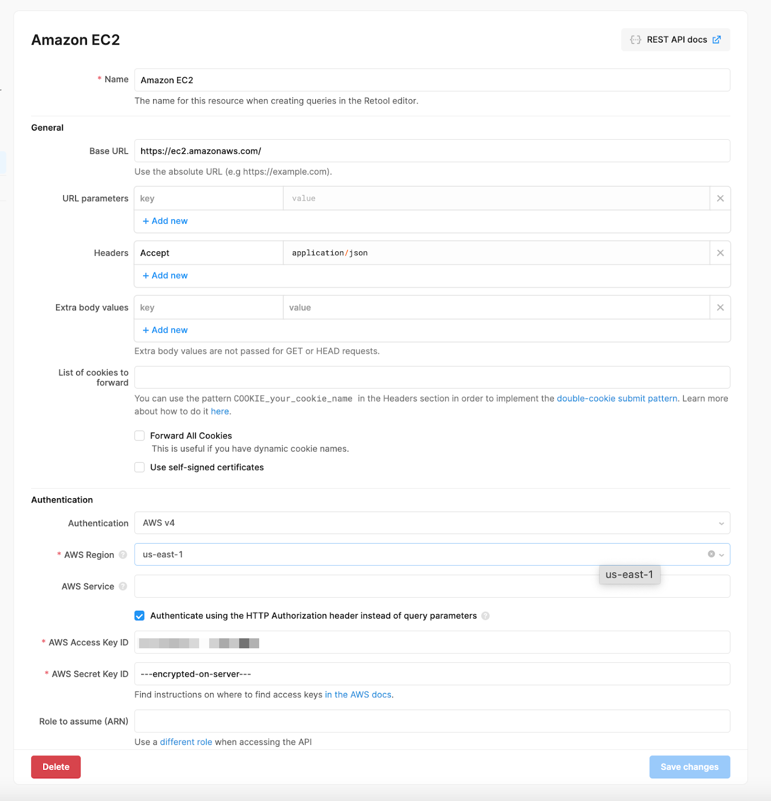
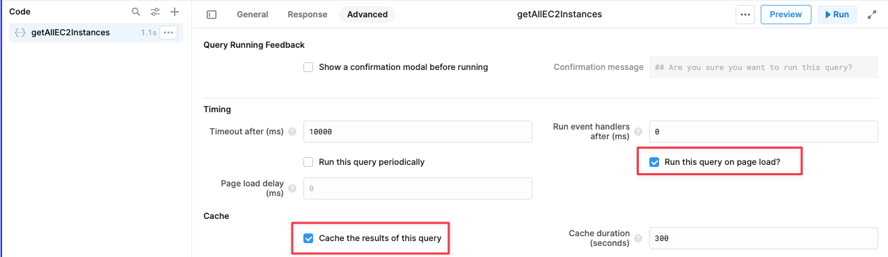
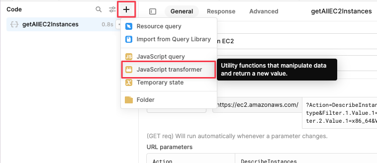
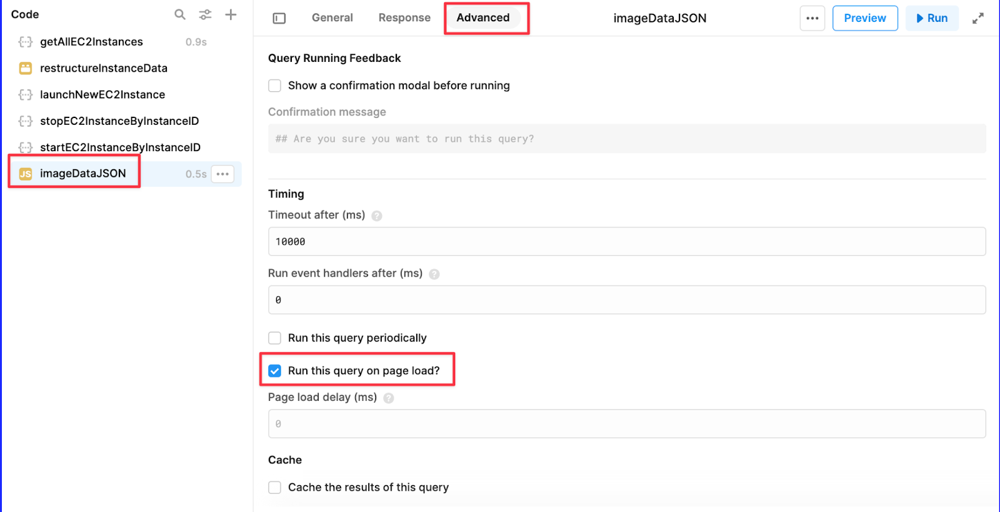
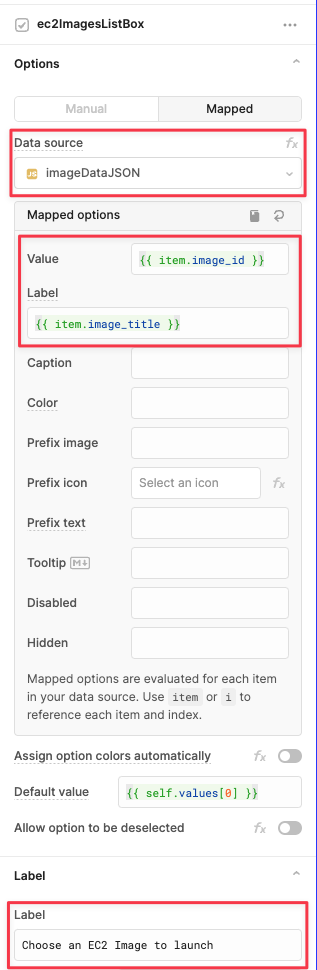
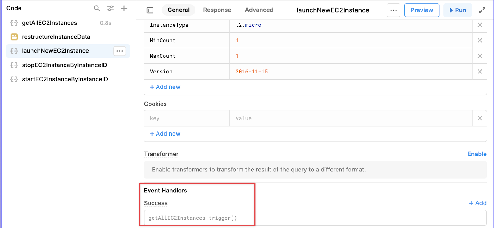

# Module 2: Building the Amazon EC2 Management Admin Panel (45 mins)

## Overview

In this module, you will learn how to use Retool and Amazon EC2 API to build an EC2 Instance Manager. This custom admin panel will allow you to launch a new EC2 instance by choosing an Amazon image (using a preselected list of virtual server images available in AWS Free tier), list all EC2 instances in a table, along with start and stop buttons for each instance.


## What you will learn:

1. How to use Retool to connect to [Amazon EC2 API](https://docs.aws.amazon.com/AWSEC2/latest/APIReference/making-api-requests.html)
2. How to retrieve data from Amazon EC2 API to display using [Retool’s component library](https://retool.com/components)
3. How to use [Listbox](https://retool.com/components/listbox) component in Retool as an input for a query to launch an EC2 instance
4. How to use [Button](https://retool.com/components/button) component to trigger a query, which will launch a new EC2 Instance
5. How to use [Table](https://retool.com/components/table) component to display a list of EC2 instances
6. How to add action buttons for each table row to trigger an EC2 API call to start or stop an instance
7. How to cache the results of a Resource Query

### Option to Import JSON File to Create App
> We highly recommend following each step to get the most out of the guide. 
> 
> However, if you prefer, you can skip Part 2 of this module and [import](https://docs.retool.com/docs/import-export-apps?ref=retool-blog) this JSON file to create the app. 
> 
> Keep in mind that **you will still need to go through Part 1 of this module**, and create a Resource since it connects to the AWS API with your AWS credentials.
> 
> - [JSON for this app](/ec2_instance_manager_app.json)
> - [Instructions to create a new app using a JSON file](https://docs.retool.com/docs/import-export-apps?ref=retool-blog)


## Part 1: Create a Resource in Retool for Amazon EC2 API (20 Mins)

1. Get your AWS Credentials following the instructions here.
2. Create a new Resource for Amazon EC2 API in Retool using the AWS credentials
    | Property          | Value                                 |
    | ----------------- | ------------------------------------- |
    | Name              | `Amazon EC2 API`                      |
    | Base URL          | `https://ec2.us-east-1.amazonaws.com` |
    | Authentication    | `AWS v4`                              |
    | AWS Region        | `us-east-1`                           |
    | AWS Access Key ID | `YOUR AWS Access Key ID>`             |
    | AWS Secret Key ID | `YOUR AWS Secret Key ID>`             |



> - 

## Part 2: Create the Retool app using this Resource (45 mins)

### 1-Writing Resource Queries to connect with the EC2 API 

1. Create a new Retool App

#### 1-Launch a new instance
In the new Retool app, create a new Resource query to launch a new instance using EC2 API’s `RunInstances` action.
  | Property     | Value                                                        |
  | ------------ | ------------------------------------------------------------ |
  | Rename it to | `launchNewEC2Instance`                                       |
  | Action Type  | `POST`                                                       |
  | Headers      | `Content-Type` : `application/x-www-form-urlencoded; charset=utf-8` |
  | Body         | `x-www-form-urlencoded`                                      |
  | Body Params  |                                                              |
  | Action       | `RunInstances`                                               |
  | ImageId      | `ami-0dfcb1ef8550277af`                                      |
  | InstanceType | `t2.micro`                                                   |
  | MinCount     | `1`                                                          |
  | MaxCount     | `1`                                                          |
  | Version      | `2016-11-15`                                                 |

#### 1-List all instances
1. Create a new Resource query to list all instances using EC2 API’s `DescribeInstances` action.
    | Property    | Value                                                        |
    | ----------- | ------------------------------------------------------------ |
    | Name        | `getAllEC2Instances`                                         |
    | Action type | `GET`                                                        |
    | URL Params  | `?Action=DescribeInstances&Filter.1.Name=instance-type&Filter.1.Value.1=t2.micro&Filter.2.Name=architecture&Filter.2.Value.1=x86_64&Version=2016-11-15` |

> **Note:** In this request, we are using two filters to search for instances with specific attributes -
>1. **instance-type:** Instance type refers to an EC2 template that specifies the amount of resources (such as CPUs and memory) that a virtual machine will have. In this case, the value for the instance-type filter is "t2.micro", which are instances that have 1 vCPU and 1GB of memory.
> 2. **architecture:** Architecture refers to the type of processor used by the instance. In this case, the value for the architecture filter is "x86_64", which refers to a 64-bit processor architecture commonly used in personal computers.


2. Click on **Run** to see the results of the API. You can also explore the data in the **State** tab in the left panel.


3. **Enable caching of query results and run the query on page load**
    1. Click **Advanced** tab in `getAllEC2Instances`’s query editor
    2. Check the `Cache the results of this query` box. This will store the results of the query and prevent the need to make the request each time, improving performance and load speeds of the application.
    3. Check the `Run this query on page load?` box. This will ensure that our table of EC2 instances is automatically populated when the app opens, we will also check the box 



4. **Transforming the data to make it easy to navigate:** The XML data returned by the EC2 API is deeply nested, making it difficult to extract the relevant information for each instance. So, we will write a bit of custom JavaScript code to “transform” the data into an easily readable array of objects using a JavaScript Transformer.

5. Add a new Transformer to format instance data for `getAllEC2Instances` Resource query
    1. Name it `transformInstanceData`
    2. Paste the following code - 




```javascript
// Store data from the EC2 API in the variable data
const data = {{getAllEC2Instances.data.parsedXml.DescribeInstancesResponse.reservationSet['0'].item}};
      
// Initialize an empty array to hold final data
let finalData = [];

// Function to capitalize the first letter of a string
function capitalizeFirstLetter(string) {
  return string.charAt(0).toUpperCase() + string.slice(1);
}

// Loop through each key in the data object
Object.keys(data).forEach(key => {

  // Retrieve specific data points for each instance and assign to variables
  let architecture = data[key].instancesSet[0].item[0].architecture[0];
  let dnsName = data[key].instancesSet[0].item[0].dnsName[0];
  let instanceState = capitalizeFirstLetter(data[key].instancesSet[0].item[0].instanceState[0].name[0]);
  let imageId = data[key].instancesSet[0].item[0].imageId[0];
  let reservationId = data[key].reservationId[0];
  let ipAddress = typeof(data[key].instancesSet[0].item[0].ipAddress) !== 'undefined' ? data[key].instancesSet[0].item[0].ipAddress[0] : 'N/A';
  let instanceName = typeof(data[key].instancesSet[0].item[0].tagSet) !== 'undefined' ? data[key].instancesSet[0].item[0].tagSet[0].item[0].value[0] : 'N/A'; 
  let launchTime = data[key].instancesSet[0].item[0].launchTime[0];
  let instanceId = data[key].instancesSet[0].item[0].instanceId[0];
  let groupName = data[key].instancesSet[0].item[0].groupSet[0].item[0].groupName[0];
  let region = data[key].instancesSet[0].item[0].placement[0].availabilityZone[0];

  // Create a new object containing all relevant data points
  let newObj = {
    'architecture': architecture,
    'dnsName': dnsName,
    'instanceState': instanceState,
    'imageId': imageId,
    'reservationId': reservationId,
    'ipAddress': ipAddress,
    'instanceName': instanceName,
    'launchTime': launchTime,
    'instanceId': instanceId,
    'groupName': groupName,
    'region': region
  };

  // Add new object to the finalData array
  finalData.push(newObj);
});

// Log finalData to the console and return it
console.log(finalData);
return finalData;
```

6. Click on **Preview** to see the results of this transformer. As you can see, it’s much cleaner and easier to read and navigate.


#### 3-Stop an instance
**Create a new Resource query to Stop an instance:** using EC2 APIs StopInstances action 

  | Property     | Value                                                        |
  | ------------ | ------------------------------------------------------------ |
  | Name         | `stopEC2InstanceByInstanceID`                                |
  | Action Type  | `POST`                                                       |
  | Headers      | `Content-Type: application/x-www-form-urlencoded; charset=utf-8` |
  | Body         | `x-www-form-urlencoded`                                      |
  | Body Params  |                                                              |
  | Action       | `StopInstances`                                              |
  | InstanceId.1 | `{{manageInstancesTable.selectedRow.data.instanceId}}`       |
  | Version      | `2016-11-15`                                                 |


#### 4-Start an instance
**Create a new Resource query to Start an instance:** using EC2 APIs `StartInstances` action 

1. Duplicate the `stopEC2InstanceByInstanceID` query

  | Property     | Value                          |
  | ------------ | ------------------------------ |
  | Rename it to | `startEC2InstanceByInstanceID` |
  | Body Params  |                                |
  | Action       | `StartInstances`               |

2. Everything else remains the same as `stopEC2InstanceByInstanceID`

### 2-Getting the EC2 image data for the Listbox
You can use Amazon EC2’s DescribeImages action to get details about the images. But since we only want to list the images available in the free tier, instead of calling an API, we will simply create a JSON object with the list of images we want to display.

1. Add a **JavaScript Query** that returns a simple JSON object for list of EC2 images to choose from
    1. Click on the **+** button in the left side panel, and click **JavaScript query** 
        1. Name this query `imageDataJSON` 
        2. Paste this code below into it


```javascript
const imageData = [
  {
    "id": 1,
    "image_id": "ami-0c2b0d3fb02824d92",
    "image_title": "Microsoft Windows Server 2022 Base",
    "show_flag": true
  },
  {
    "id": 2,
    "image_id": "ami-0dfcb1ef8550277af",
    "image_title": "Amazon Linux 2 AMI (HVM) - Kernel 5.10",
    "show_flag": true
  },
  {
    "id": 3,
    "image_id": "ami-0c9978668f8d55984",
    "image_title": "Red Hat Enterprise Linux 9",
    "show_flag": true
  },
  {
    "id": 4,
    "image_id": "ami-0557a15b87f6559cf",
    "image_title": "Ubuntu Server 22.04 LTS",
    "show_flag": true
  }
]

return(imageData)
```




2. **Pre-load the Image data when the app launches:** To ensure our Listbox is automatically populated when the app opens, we will check the box Run this query on page load? in the advanced tab for the `imageDataJSON` query.


1. Drag a **Text component** to the canvas. Name it appTitleText
    1. Value: `## AWS EC2 Instance Manager`
2. Drag two **Container components** and align them vertically
    2. The top container will contain the UI for choosing and launching a new instance.
    3. The bottom container will contain the table listing the instances


### 3-Designing the top container to choose and launch EC2 images

1. Name the top container `launchInstanceContainer`
2. Set the title for container Title to `#### Launch new EC2 Instance`
3. Drag a ListBox component to the first container, and set the properties in the right panel inspector to - 

| Property                                   | Value                           |
| ------------------------------------------ | ------------------------------- |
| Rename it to                               | `ec2ImagesListBox`              |
| Data source                                | `imageDataJSON`                 |
| <u>*Under Mapped options*</u>              |                                 |
| Value                                      | `{{ item.image_id }}`           |
| Label                                      | `{{ item.image_title }}`        |
| Under *<u>Label Section</u>*, set label to | `Choose an EC2 Image to launch` |



1. Drag a Button component to the first container, and set the properties in the right panel inspector to - 

| Property      | Value                     |
| ------------- | ------------------------- |
| Rename it to  | `launchNewInstanceButton` |
| Text          | `Launch New EC2 Instance` |
| Event Handler |                           |
| Action        | `Control query`           |
| Query         | `launchNewEC2Instance`    |
| Method        | `Trigger`                 |
| Prefix Icon   | Set it to your choice     |


### 4-Designing the bottom container 

1. Name the bottom container manageInstancesContainer
2. Set the title for Container Title to `#### Manage Instances`
3. Drag a Table component to the second container, and set the properties in the right panel inspector to - 

    | Property       | Value                             |
    | -------------- | --------------------------------- |
    | Name           | `manageInstancesTable`            |
    | Data           | `{{transformInstanceData.value}}` |
    | Sort column    | `Launch Time`                     |
    | Sort direction | `Desc`                            |

  4. Add two action buttons for the Table
      1. Action 1 (Stop)
            | Property           | Value                         |
            | ------------------ | ----------------------------- |
            | Action button text | `Stop`                        |
            | Action button type | `Run a query`                 |
            | Action query       | `stopEC2InstanceByInstanceID` |
      2. Action 2 (Start)
            | Property           | Value                          |
            | ------------------ | ------------------------------ |
            | Action button text | `Start`                        |
            | Action button type | `Run a query`                  |
            | Action query       | `startEC2InstanceByInstanceID` |
  5. Add background color for instanceState column in the table using RGBA css color codes
        1. With the table selected, navigate to Columns in the right panel inspector
        2. Click on `instanceState` column, and paste this conditional code in it.

```javascript
{{self.toLowerCase() === "running" ? 'rgba(165, 255, 110, 0.5)':self.toLowerCase() === "stopped" ? 'rgba(255, 141, 150, 0.5)':'rgba(255, 188, 99, 0.5)'}}
```
> **What this does**
> 
> If the state is “running”, then the color code rgba(165, 255, 110, 0.5) is returned, representing a light green color with a 50% transparency.
> 
> If the state is “stopped”, then the color code rgba(255, 188, 99, 0.5) is returned, representing a light red color with a 50% transparency.


11. **Refresh the table after launching a new instance:** To ensure that the table automatically displays data when an instance is launched, stopped, or restarted, we will add `getAllEC2Instances` query to the Success section of the `launchNewEC2Instance`, stopEC2InstanceByInstanceID and startEC2InstanceByInstanceID queries, so it’s fired off automatically when these queries run successfully.



# Wrapping Up

Congratulations! You've successfully completed this self-guided workshop and built two Retool apps that connect to AWS APIs. You learnt how to use Retool to retrieve and display data, create tabbed containers, use list boxes as inputs for queries, and visualize data with charts.

Remember, these two apps are just the tip of the iceberg when it comes to what you can build with Retool and AWS. The possibilities are endless, and we encourage you to continue exploring and building on what you've learned here.

If you have any questions or feedback, please don't hesitate to reach out to us. We'd love to hear your thoughts and help in any way we can.

Thanks again for your time and effort in completing this workshop. We hope you found it valuable and look forward to seeing what you'll create next with Retool.
